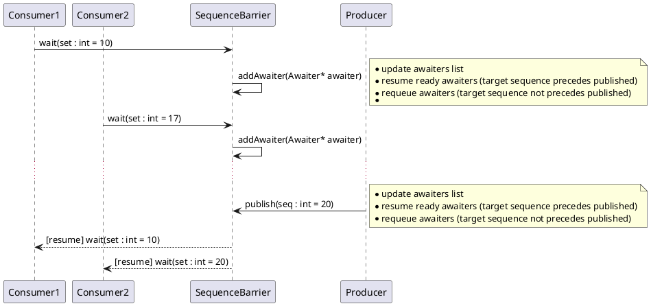

# Introduction

A `SequenceBarrier` is a synchronization primitive that allows a single-producer and multiple consumers to coordinate
with respect to a monotonically increasing sequence number.

A single producer advances the sequence number by publishing new sequence numbers in a monotonically increasing order.
One or more consumers can query the last published sequence number and can wait until a particular sequence number
has been published. Sequence number has equal or greater value (not greater than `max(TSequence) / 2 + 1` value)
than an awaited by consumer.

A sequence barrier can be used to represent a cursor into a thread-safe producer/consumer ring-buffer

# Dynamic behaviour

