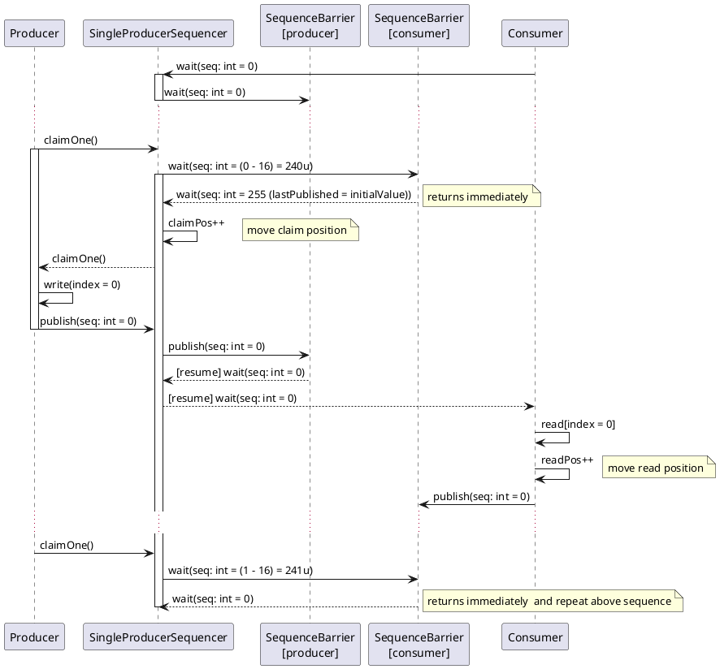

# Introduction

A `SingleProducerSequencer` is a synchronization primitive that can be used to coordinate access to a ring-buffer
for a single producer and one or more consumers.

A producer first acquires one (`claimOne` method) or up to given count (`claimUpTo` method) slots in a ring-buffer,
writes to the ring-buffer elements to those slots, and then finally publishes the values written to those slots.
A producer can never produce more than `bufferSize` elements in advance of where the consumer has consumed up to.

A consumer then waits for certain elements to be published, processes the items and then notifies the producer
when it has finished processing items by publishing the sequence number it has finished consuming in a `SequenceBarrier`
object.

# Dynamic behaviour

