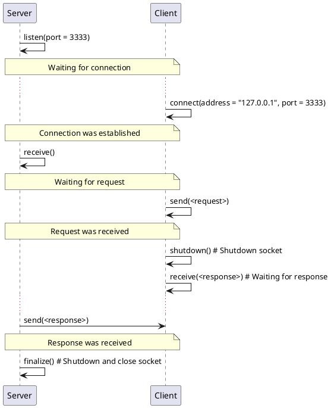

# Synchronous TCP P2P Server/Client Example

* TcpServer - synchronous TCP P2P server implementation
* TcpClient - synchronous TCP P2P client implementation

```plantuml
@startuml

participant Server
participant Client

Server -> Server : listen(port = 3333)
note over Server,Client: Waiting for connection
...
Client -> Client : connect(address = "127.0.0.1", port = 3333)
note over Server,Client: Connection was established
Server -> Server : receive()
note over Server,Client: Waiting for request
Client -> Client : send(<request>)
note over Server,Client: Request was received
Client -> Client : shutdown() # Shutdown socket
Client -> Client : receive(<response>) # Waiting for response
...
Server -> Client : send(<response>)
note over Server,Client: Response was received
Server -> Server : finalize() # Shutdown and close socket


@enduml
```