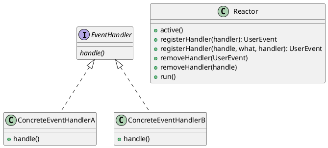

# Introduction

The `Reactor` architectural pattern allows event-driven applications to demultiplex and dispatch
service requests that are delivered to an application from one or more clients.

The reactor synchronously wait for the arrival of indication events on one or more event sources.
For each service an application introduce a separate `event handler` that process certain types of
events from certain event sources.
When indication events occur, the synchronous event demultiplexer notifies the `reactor`,
which then synchronously dispatches the `event handler` associated with the event so that it can
perform the requested service.

The synchronous event demultiplexer implementation is system dependent.

The `event handler` specifies hook method which represents the set of operations available to
process specific event that occur.

Concrete `event handler` specialize the event handle and implement a specific service. Each concrete
`event handler` is responsible for processing indication events received through associated handle
(handle to file, socket or user handle).

# Class Diagram



# Dynamic Behaviour

```plantuml

participant Reactor
participant "Concrete\nEvent\nHandler" as Handler
participant "Synchronous\nEvent\nDemultiplexer" as Demuxer

-> Reactor : registerHandler(handle, what, handler)
activate Reactor
Reactor -> Demuxer : select()
note right: Blocked call to wait for indication events
...
-> Demuxer : <event>
note right: Indication event was triggered
Demuxer -> Reactor : dispatchEvent(handle, what, arg)
activate Demuxer
Reactor -> Handler : process(handle, what)
Demuxer <-- Reactor
deactivate Demuxer
deactivate Reactor
```