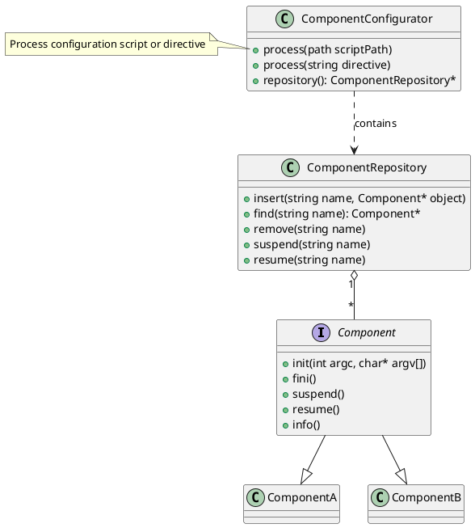
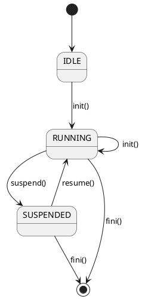

# Introduction

The Component Configurator design pattern allows an application to link and unlink its component
implementations at run-time without having to modify, recompile, or statically relink
the application.

Component Configurator further supports the reconfiguration of components into different
application processes without having to shut down and re-start running processes.

Pros:
 * Uniformity (one configuration and control interface)
 * Centralized administration
 * Modularity, testability, and reusability
 * Configuration dynamism and control (supporting of dynamically reconfiguration)
 * Tuning and optimization

Cons:
 * Lack of determinism and ordering dependencies (less predictability)
 * Reduced security or reliability (impostors can masquerade as components in DLLs)
 * Increased run-time overhead and infrastructure complexity (more indirections)
 * Overly narrow common interfaces (initialization or termination of a component may be too complicated)

# Structure

Responsibility:
* Component repository - manages all concrete components.
* Component configurator - uses the component repository to coordinate the (re)configuration of concrete components.

Overall structure:


Concrete component lifecycle:


# Dynamics

* __Component initialization__
  The component configurator dynamically links a component into an application and initializes it.3 After a component has been initialized successfully the component configurator adds it to its component repository. This repository manages all configured components at run-time.
* __Component processing__
  After being configured into an application, a component performs its processing tasks, such as exchanging messages with peer components and performing service requests. The component configurator can suspend and resume existing components temporarily, for example when (re)configuring other components.
* __Component termination__
  The component configurator shuts down components after they are no longer needed, allowing them the opportunity to clean up their resources before terminating. When terminating a component, the component configurator removes it from the component repository and unlinks it from the application’s address space.

Example of configuration script:
```text
# Configure a Time Server.
dynamic TimeServer Component *
   cristian.dll:makeTimeServer()
      "-p $TIME_SERVER_PORT"
```
* Dynamically link the mentioned DLL
* Invoke `makeTimeServer()` factory method to allocate object of type TimeServer
* Pass `-p $TIME_SERVER_PORT` to newlly allocated object as `argc/argv` arguments

# Reference

* "Pattern-Oriented Software Architecture, Volume 2, Chapter 2" By Douglas C. Schmidt, Michael Stal, Hans Rohnert, Frank Buschmann
