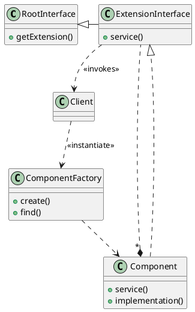
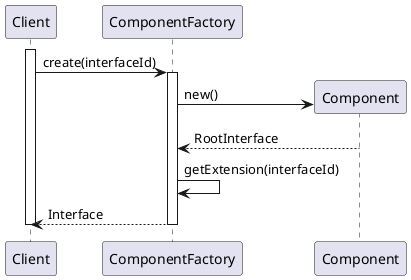
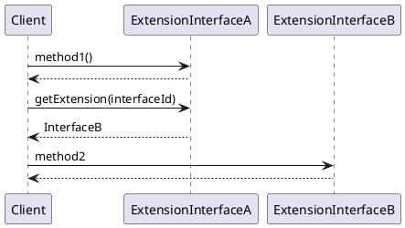

# Introduction

The Extension Interface design pattern allows multiple interfaces to be exported by a component, 
to prevent bloating of interfaces and breaking of client code when developers extend or modify
the functionality of the component.

Export component functionality via extension interfaces, one for each semantically-related set of
operations. A component must implement at least one extension interface. To add new functionality
or to modify existing component functionality, export new extension interfaces rather than modify
existing one. Clients should access a component via its extension interface.

To enable clients to create component instances and retrieve component extension interfaces introduce
an associated component factory for each component type. Ensure that it returns an initial interface
reference that clients can use to retrieve other component extension interfaces. Each interface should
inherit from a _root interface_ that defines functionality common to all components, such as
the mechanism for retrieving a particular extension interface.

The _root interface_ provides three types of functionality:
* core functionality (e.g. retrieving other extension interfaces)
* (optional) domain-independent functionality (e.g. methods that manage component life-cycle)
* (optional) domain-specific functionality

The _root interface_ defines functionality that each extension interface must provide.
The _extension interface_ defines a role-specific interface offered by a component.!nirva   

Pros:
* Extensibility (extending the functionality of a component should only require adding new extension interfaces)
* Separation of concerns (semantically-related functionality can be grouped together into separate extensions interfaces)
* Polymorphism (polymorphism is supported without requiring inheritance from a common interface)
* Decoupling of components and their clients (clients access extension interfaces rather than component implementation)
* Support for interface aggregation and delegation

Cons:
* Increased component design and implementation effort
* Increased client programming complexity
* Additional indirection and run-time overhead

# Structure

_Component_ responsibility:
* plays different roles
* implements extension interfaces
* return initial interface to component factory

_Component Factory_ responsibility:
* defines functionality for creating new components
* (optionally) contains functionality for locating existing components

# Dynamics

Scenario 1: Clients create new components and retrieve and initial extension interface:
* client requests a component factory to create a new component and return a reference to a particular
  extension interface
* the component factory create a new component and retrieves a reference to its root interface
* the component factory using retrieved reference to root interface asks for requested extension
  interfaces and returns it to client

Scenario 2: Collaboration between clients and extension interfaces:
* client invokes a method on extension interface A
* the implementation of extension interface A within the component executes the requested method and
  return result (if any)
* client calls the `getExtension()` methods (from _root interface_)
* the implementation of extension interface A locatesthe requested extension interface B and returns
  the client a reference to it
* client invokes a method on extension interface B

