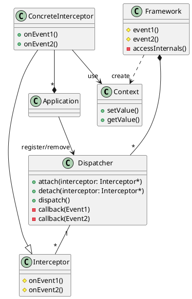
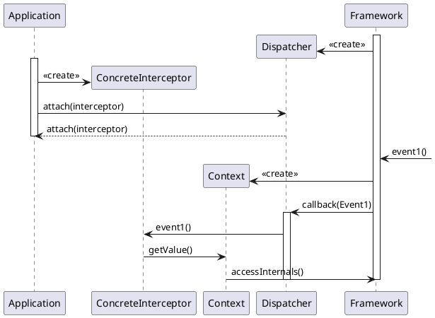

# Introduction

The Interceptor architectural pattern allows services to be added transparently to a framework and triggered
automatically when certain events occur.

Allow applications to extend an any framework functionality transparently by registering services via predefined
interfaces, then let the concrete framework trigger these services automatically when certain events occur.

In details, framework specify and expose and _interceptor_ callback interface. _Applications_ can derive
_concrete interceptors_ from this interface to implement out-of-band services that process occurrences of
some particular events in an application specific manner. _Dispatchers_ allows applications to register
their concrete interceptors. When the particular events occur, the framework notifies the appropriate
dispatchers to invoke the callbacks of the registered concrete interceptors.

# Structure

Interceptor responsibilities:
* implements an out-of-band service
* uses context object to control the framework

Dispatcher responsibilities:
* allows application to attach and detach concrete interceptors
* dispatches registered interceptor callbacks when events occur

Context object responsibilities:
* allows services to obtain information from the framework
* allows services to control certain behaviour of framework

Application responsibilities:
* runs framework
* implements concrete interceptors and registers them with dispatchers

# Dynamics

* An application instantiates a concrete interceptor that implements a specific interceptor interface.
  The application registers this concrete interceptor with the appropriate dispatcher.
* The framework subsequently receives an event that is subject to interception.
* The framework notifies the appropriate dispatcher about the occurrence of the event,
  passing the context object as a parameter.
* The dispatcher iterates through attached interceptors and invokes callback methods, passing the context
  object as an argument.
* Each interceptor can use given context object to retrieve any information or control the behaviour of the
  framework.
* After all concrete interceptor callback methods are done, the framework continues with its normal operation.

