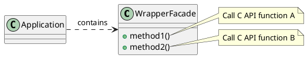

# Introduction

The Wrapper Facade design pattern encapsulates the functions and data provided by existing
non-object-oriented APIs within more concise, robust, portable, maintainable, and cohesive
object-oriented class interfaces.

Pros:
* Concise, cohesive and robust higher-level object-oriented programming interfaces
* Portability and maintainability
* Modularity, re-usability and configurability

Cons:
* Loss of functionality (an 'escape-hatch' mechanism can be used)
* Performance degradation (additional indirection)
* Programming language and compiler limitations (define interfaces across different languages)

# Structure

Responsibility:
* Component repository - manages all concrete components.
* Component configurator - uses the component repository to coordinate the (re)configuration of concrete components.

# Dynamics

Collaborations in the Wrapper Facade pattern are:
* Application code invokes a method on an instance of the wrapper facade
* Wrapper facade methods forward the request and its parameters to one or more of the lower-level API functions that it encapsulates, passing along any internal data needed by the underlying function(s).

# Reference

* "Pattern-Oriented Software Architecture, Volume 2, Chapter 2" By Douglas C. Schmidt, Michael Stal, Hans Rohnert, Frank Buschmann
